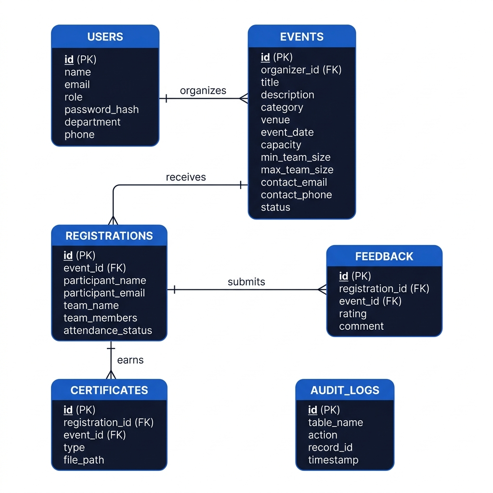
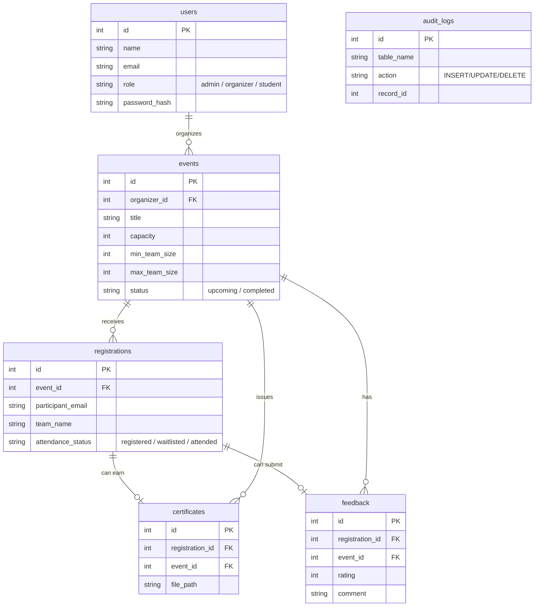

# College Event Management System

A comprehensive, role-based database management system built using Flask and SQLite, designed designed to facilitate end-to-end college event management. It incorporates advanced DBMS features like views, triggers, and waitlist auto-promotion logic.

## 🗄️ Entity Relationship (ER) Diagram



Below is the full schema in Mermaid notation for reference:



## 🚀 How It Is Used & Workflows

The application handles three primary stakeholders with interconnected lifecycles:

### 1. Organizer Workflow (Event Creators)
- **Create Events:** Organizers can spin up new events, defining hard constraints like `capacity`, `min_team_size`, `max_team_size`, and their `contact_email` / `contact_phone`.
- **Manage Registrations:** Organizers can manually add participants (teams or solo) and cancel any registration if needed.
- **Automated Waitlists:** If an Organizer cancels a user's registration, the SQL backend automatically pulls up the oldest `'waitlisted'` user into the newfound `'registered'` slot.
- **Mark Attendance:** When the event arrives, organizers use the Attendance page to move participants from `'registered'` to `'attended'` or `'absent'`.
- **Analytics Reports:** Post-event, the Event Analytics report (powered by a SQL `VIEW`) shows total registrations, attendance counts, and average feedback ratings.

### 2. Student Workflow (Participants)
- **Explore & Register:** Students browse upcoming events. The registration form dynamically scales — showing team member inputs based on the Organizer's `min_team_size` / `max_team_size` rules. Solo events show no extra fields.
- **Cancel Registration:** Students can cancel their own registration at any point from the event detail page.
- **Waitlisted Queue:** If capacity is reached, they safely enter a Waitlist and are auto-promoted if a spot opens.
- **Post-Event Feedback:** Verified attendees (marked as `attended` on a `completed` event) can rate the event out of 5 stars and leave comments.

### 3. Administrator Workflow (Oversight)
- **User Management:** Admins can view all registered users across all roles.
- **Analytics:** Admins lean on the `event_analytics` SQL `VIEW` which dynamically calculates turnout rates and average star ratings.
- **Audit Logs:** Every `INSERT`, `UPDATE`, and `DELETE` on the `events` table is silently captured by database `TRIGGERS` into the `audit_logs` table, surfaced via the Audit Logs page.

---

## 🛠️ Setup Instructions

1. **Environment Setup**
   Ensure Python 3.10+ is installed.
   ```bash
   python3 -m venv venv
   source venv/bin/activate
   pip install -r requirements.txt
   ```

2. **Database Initialization**
   Requires SQLite3 to be installed. The schema initializes the tables and testing data.
   ```bash
   sqlite3 college_ems.db < schema.sql
   ```

3. **Start Application**
   ```bash
   python app.py
   ```
   Server will run on `http://127.0.0.1:5000`

## Default Credentials
All passwords are set to `password123`.
- Admin: `admin@college.edu`
- Organizer: `alice@college.edu`
- Student: `s1@college.edu` (Requires manual registration via UI if not present)
